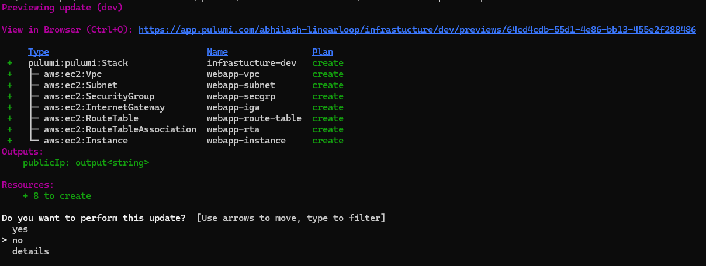

# Pulumi-localstack-task

### Prerequisites
Before you start, ensure you have the following installed:

- Node.js and npm [For running react-shopping-cart app]
- Docker
- Docker Compose
- AWS CLI
- Pulumi
- LocalStack

## Installation

- ### AWS CLI
    - Follow this link [AWS CLI](https://docs.aws.amazon.com/cli/latest/userguide/getting-started-install.html) and set up AWS CLI on your machine.
    - Configure AWS CLI using this link [AWSCLI](https://docs.aws.amazon.com/cli/latest/userguide/cli-configure-files.html)
    - Create the default AWS profile.
    - Once setup is done, Install Pulumi and LocalStack

- ### Pulumi

    - Click on this link [Pulumi](https://www.pulumi.com/docs/install/) and follow the instructions to set up Pulumi in your machine

- ### LocalStack
  
    - Need Docker to run LocalStack in your machine.
    - It is ideal to install LocalStack by following this [link](https://docs.localstack.cloud/getting-started/installation/).
    - Using LocalStack via Docker is the simplest way to run LocalStack on your machine
    - Run the below command to set up the LocalStack [NOTE:- The Only Drawback is it does not store state of LocalStack in docker we can do that via docker-compose]
      ```
          docker run  --rm -it  -p 4566:4566  -p 4510-4559:4510-4559 --name localstack localstack/localstack
      ```
    - OR you can use docker-compose to run the LocalStack on your machine. 
      ```
          cd infrastructure/localstack
          docker compose up -d
          docker compose logs -f
      ```
    - For using `localstack` commands use the below command
      ```
          docker exec -it localstack /bin/bash
      ```
      and then you can use `awslocal` command

    - For testing out a resource list you can use the below command [NOTE:- Run the below command after running localstack pulumi stack]
      ```
          awslocal ec2 describe-instances --region us-east-2
      ```

- - - -

## Deployment

- ### Deploying Infra using Pulumi to AWS

    1. Clone project [Repo link](https://github.com/abhilash-linearloop/Pulumi-localstack-task.git)

    2. Assuming the above installation steps are completed. Follow the  below instructions
        ```
        cd Pulumi-localstack-task/infrastructure
        pulumi up
        ```
     [***NOTE: The above commands will provision the required infrastructure for hosting react-shopping-cart app using a default profile if the AWS profile is configured***]

    3. Once you run `pulumi up` command you need to select `yes` option as shown in the image
        <div align="center">
            
        </div>

    4. Once pulumi provision infra, In output EC2 instance IP will be displayed.

- ### Simulation for Infra using Pulumi and LocalStack

    [***NOTE: The following section will provide detailed steps for this manual configuration, assuming you have Pulumi installed***]

    1. Create a new stack from the existing stack using the below command
        ```
            pulumi stack init localstack --copy-config-from dev
        ```
    2. Once created new stack, copy the endpoints into the newly created stack file [***NOTE:- Currently it is already created]. Endpoints can be copied from this [URL](https://docs.localstack.cloud/user-guide/integrations/pulumi/)
        ```
            config:
              aws:accessKey: test
              aws:s3UsePathStyle: "true"
              aws:secretKey: test
              aws:skipCredentialsValidation: "true"
              aws:skipRequestingAccountId: "true"
              aws:region: us-east-2
              aws:endpoints:
                - ec2: http://localhost:4566
        ```
        Use the above config in the newly created stack file.
    3. Once the configuration is updated in the new stack file. Run the following command to simulate using localstack
        ```
            pulumi stack ls
            pulumi stack select localstack
            pulumi up
        ```
        [***NOTE:- Make sure the LocalStack is running via docker or docker-compose before simulating above stack]

[***NOTE:- Tried the Pulumi wrapper for LocalStack but it failed due the some errors***]

## Differences or Limitations using the LocalStack in compared to the AWS Cloud
- The current Setup faced an error regarding AMI lookup as AMI was missing in the LocalStack, so LocalStack does not have all data as per AWS real-time. [limitations]
- Need to update LocalStack regularly if we are updating resources with the latest changes or keeping up to date.[limitations]
- Working with LocalStack for simulating resource helps to boot confidence oneself 


## Dockerfile for Web Application

- Dockerfile is located at `react-shopping-cart\Dockerfile`
